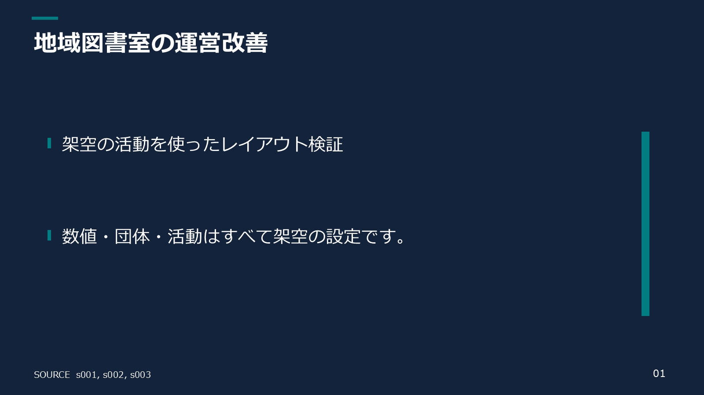
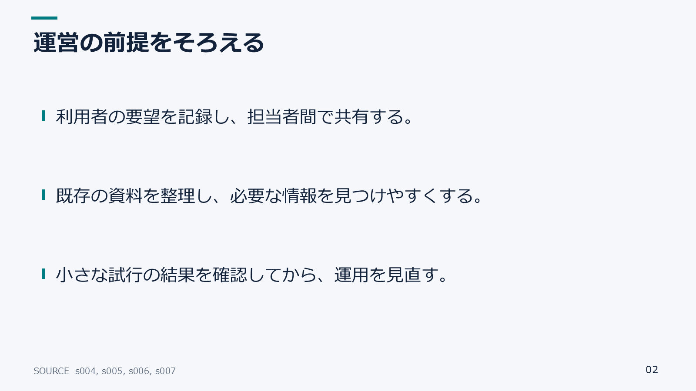
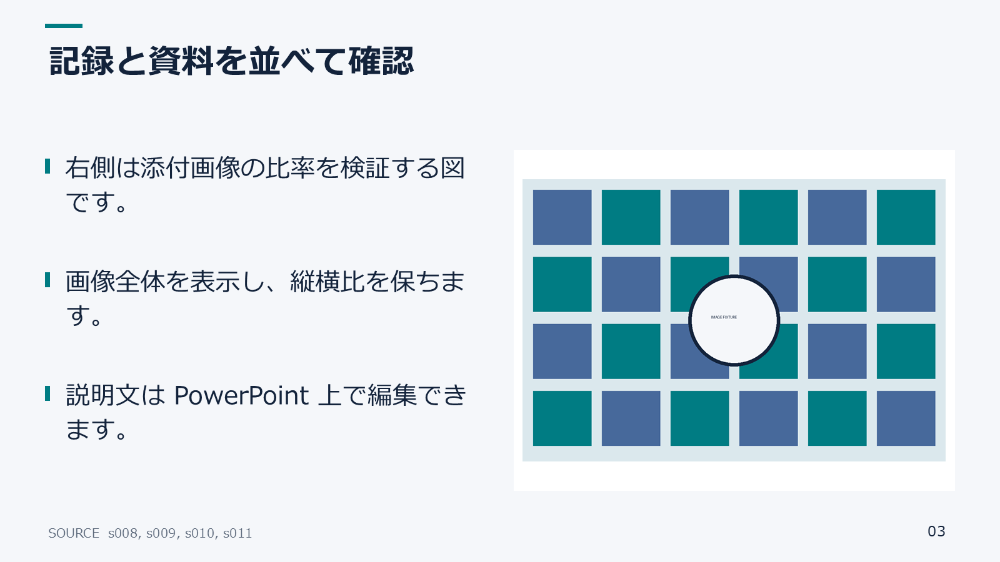
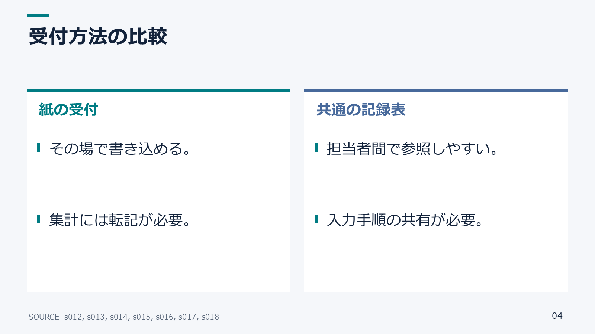
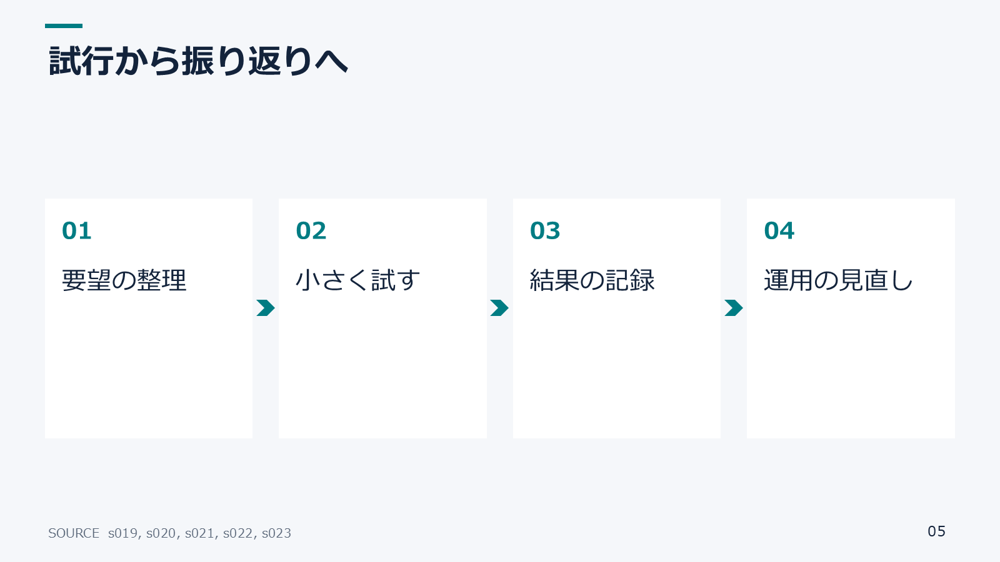
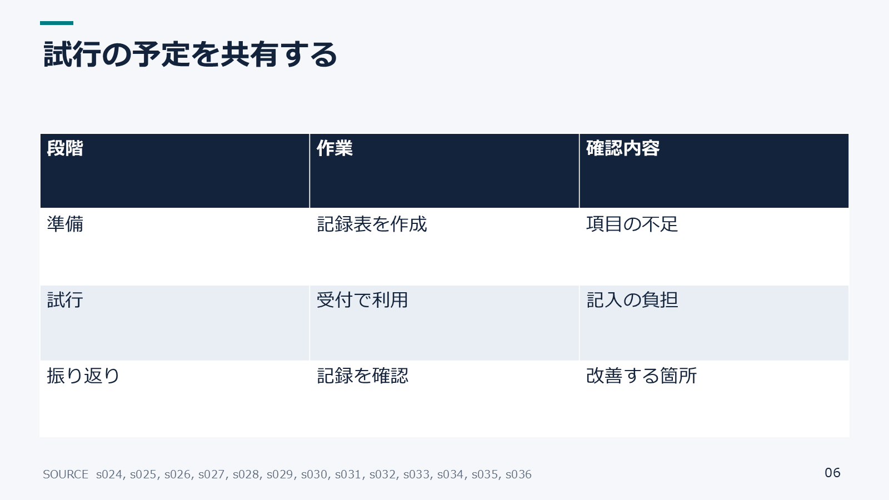
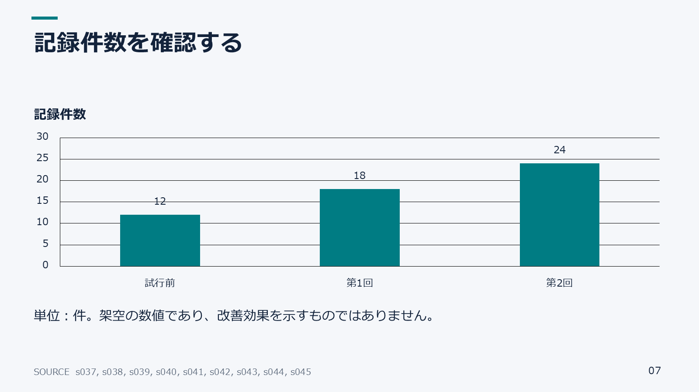
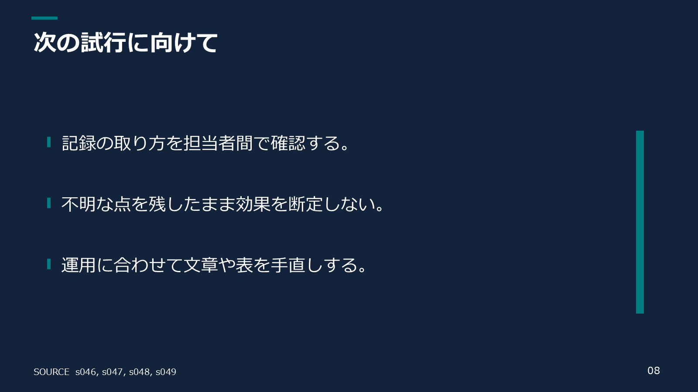

# 初版の検証記録

2026-10-06、Python 3.12.10 / python-pptx 1.0.2 / Pydantic 2.12.5 / Pillow 11.3.0、Windows と Microsoft PowerPoint、Meiryo で確認。

## 確認した範囲

- 自動テスト 22 件。日本語・少量・長文停止・表の行超過と分割・欠落画像・画像の差し替え・不正 layout/座標・画像パス逸脱・数値追加と欠落・原文改変・留保の欠落警告・明示省略・lead 方針・画像比率・二重 JSON キー・既存出力保護。
- `demo` 8枚、未構造文章＋画像の `prose` 2枚、スライド別文章の `slides` 2枚を生成。3つとも構造・内容検証に合格。
- Microsoft PowerPoint 本体で計12枚を1600×900 PNGへ書出し、全ページを視認。欠け、重なり、豆腐文字なし。通常の native text の境界計測は3冊とも overflowCount=0。
- 表・チャート内部の文字は自動境界測定の対象外だが、全ページの描画で確認。機械的測定だけで全レイアウトの健全性を保証しない。
- native な文字と表セルを Python から変更し、PPTX を保存・再読込して変更が保持されることをテスト。native chart の値も `replace_data` で変更・再読込。chart XML と埋込 XLSX の存在を検査。
- スライド XML の再生成一致をテスト。PPTX ZIP 内のタイムスタンプや埋込 workbook のメタデータまでバイト一致を保証するものではない。
- スキル作成ツールの `quick_validate.py` が `Skill is valid!` を返した。

## サンプル

| 入力 | 設計 | 編集可能な出力 |
|---|---|---|
| [全layout架空source](../examples/demo.source.json) | [全8種plan](../examples/demo.plan.json) | [demo.pptx](../examples/demo.pptx) |
| [未構造文章](../examples/prose.txt) | [Codex作成plan](../examples/prose.plan.json) | [prose.pptx](../examples/prose.pptx) |
| [スライド別文章](../examples/slides.md) | [Codex作成plan](../examples/slides.plan.json) | [slides.pptx](../examples/slides.pptx) |

[PowerPointの計測結果](../examples/rendered/render-report.json) は独立した実描画の証跡です。`*.validation.json` の `visual_review: not_performed` は Python CLI だけの検証範囲を表し、この文書の別工程での目視確認と区別しています。

## 全layoutプレビュー

| title | bullets |
|---|---|
|  |  |
| text_image | comparison |
|  |  |
| process | table |
|  |  |
| chart | closing |
|  |  |

## 残る制約

意味・留保・因果の完全な一致は人間が確認する。数値の検査は数字トークン単位であり、単位変換の妥当性や関連付けまで証明しない。別OS・代替フォント・LibreOfficeでの完全互換性は未検証。native chartは非負の数値による集合縦棒だけ。各利用者の資料は利用者の環境で改めて全ページをレビューする。

AI による構成判断は Codex のスキル実行を通して行う。Python に自律 planner、有料 API、Web UI は搭載していない。
